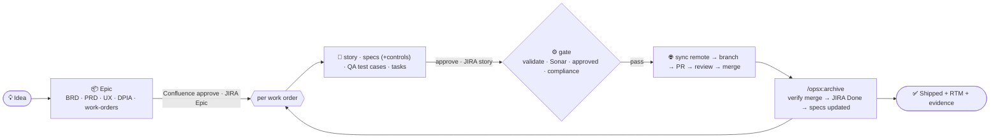

# openspec-forge

A **Forge-flavored, governed AI-SDLC** add-on for [OpenSpec](https://github.com/Fission-AI/OpenSpec):
richer artifacts (BRD/PRD/UI-UX/RTM/work-orders), a compliance + quality **gate** (UU PDP, ISO 27001,
SonarQube), and Confluence / JIRA / GitHub integration — layered on top of `openspec init` with
**no changes to OpenSpec's core** (it's a custom schema + companion scripts).

## The pipeline



## Install

Run from your project root, **after** `openspec init`.

**bash / zsh:**

```bash
curl -fsSL https://raw.githubusercontent.com/c0d3beat/openspec-forge/main/install.sh | bash
```

**PowerShell:**

```powershell
irm https://raw.githubusercontent.com/c0d3beat/openspec-forge/main/install.ps1 | iex
```

Requires **Node ≥18** and that you've already run `openspec init` in the project.
Pin a version with `FORGE_REF=v1.0.0` (bash) or `$env:FORGE_REF='v1.0.0'` (PowerShell).

## What the installer does

- Copies `openspec/forge/` + `openspec/schemas/forge-workorder/` + `openspec/schemas/forge-epic/` into your project.
- **Safely seeds** `openspec/config.yaml` and `.env` (only if absent) and appends kit lines to `.gitignore` (idempotent).
- Installs a git **`pre-commit` hook** that blocks commits on `forge/*` branches until `forge gate` passes (skip with `--no-hook`).
- Records the version in `openspec/forge/.forge-version` and runs `forge doctor`.

**Updating:** re-run the same one-liner. It detects the existing kit and refreshes the kit **code**
(scripts, `lib/`, schema templates) while **preserving your config** (`connections.yaml`, `controls/*`,
the design-system rubric, `.env`, `config.yaml`).

## After installing

- Edit `openspec/forge/connections.yaml` (JIRA/Confluence/GitHub/SonarQube) and fill `.env`.
- Read the **[end-to-end tutorial](openspec/forge/TUTORIAL.md)**, then **`openspec/forge/README.md`** (command reference) and **`openspec/forge/DESIGN.md`** (the full design).
- The installer already ran a readiness check. Then just work in your AI agent — **your commands are `/opsx:propose` (plan/author until approved), `/opsx:apply` (build one work order), and `/opsx:archive` (finalize after merge); the agent runs every `forge` command for you, you never invoke it manually.**

## Workflows

Two tools work together: **OpenSpec's `/opsx:*`** slash commands (run in Claude Code) author the artifacts,
and **`forge`** (companion scripts) does the integrations + the gate. They're wired via
`openspec/config.yaml`'s apply-guidance, so during `/opsx:apply` the agent automatically **refreshes the
Confluence approval (`forge sync confluence check`), runs `forge gate`, and refuses to write any code unless
it passes** (especially `confluence-approval`) — then sets JIRA **In Progress**, syncs the branch from the
remote, builds, scans, and opens the PR (**In Review**). `/opsx:archive` verifies the merge and marks the story **Done**.

> **You drive the whole thing with three commands** — `/opsx:propose` (plan a feature / author a work order until it's approved),
> `/opsx:apply` (build one approved work order), and `/opsx:archive` (finalize it after merge). Your only other actions are
> human sign-offs: **approve** pages in Confluence and **merge** the PR in GitHub. Every `forge …` command below is what the
> **agent** runs for you (as `node openspec/forge/forge.mjs …`) — shown short for readability; you don't type them.

### The `forge` command surface

| Command | What it does |
|---|---|
| `forge doctor [--check-connectivity]` | Readiness preflight — per-integration config/token/CLI |
| `forge gate --change <id>` | Run the advisory gate (the 8 checks below) |
| `forge scan --workorder <id> [--pr <n>]` | SonarQube CE scan → `.forge/sonar.json` |
| `forge sync confluence <publish\|check\|read-comments> --workorder <id>` | Publish docs for review, read the `approved` label, pull reviewer comments |
| `forge sync jira <story\|epic\|transition\|qa> [--workorder\|--epic <id>] [--to <status>] [--list]` | JIRA tracking (Story/Epic + status); `qa` files/reads QA-defect issues (a workflow separate from the build) |
| `forge preview <recommend\|mockup\|shot> --epic <id>` | Recommend a design system from PRD/BRD + scaffold a single-page app mockup + render one screenshot |
| `forge rtm` | (Re)generate the Requirements Traceability Matrix (`openspec/forge/rtm.md`) |
| `forge start --workorder <id> [--base main] [--force]` | Fetch origin + create/align `forge/<KEY>` from the **latest remote** (remote = source of truth) before building |
| `forge pr --workorder <id> [--scan]` | gate → branch → commit → push → open PR (Sonar summary in the body); moves JIRA → In Review |
| `forge done --workorder <id> [--result-file <pr.json>] [--assume-merged]` | Verify the PR is **merged** (gh/REST), then transition JIRA → Done (refuses if not merged) |
| `forge adopt --workorder <id> \| --epic <id> [--result-file <bundle.json>]` | **Handoff:** after a fresh clone, rebuild the gitignored `.forge/` (Confluence page IDs + approval, JIRA link/status) from the systems of record — Confluence pages found by title (no duplicates) |

All integration commands support `--dry-run` and offline `--result-file <mock.json>`; flip to real REST/git calls by filling `.env` and dropping those flags (`forge doctor` shows what's ready).

### Two tiers: Epic → Work Orders

A **feature = an Epic** (planning docs) that decomposes into **Work Orders = user stories**, each its own OpenSpec
change built one at a time on its own branch/PR.

### 1. Plan a feature (the Epic)

```bash
# in Claude Code:  /opsx:propose my-feature      (the agent scaffolds the forge-epic change)
#   → authors brd → prd → ux-design → capabilities → compliance → work-orders
#   → asks you to confirm the tech stack (frontend/backend/database) if it isn't already clear
# the agent then runs these for you:
forge preview recommend --epic my-feature            # ranks the design systems → asks you to choose
forge preview mockup    --epic my-feature            # single-page app-shell mockup in your chosen system
forge preview shot      --epic my-feature            # render ONE screenshot (auto-embedded in Confluence on publish)
forge sync confluence publish --change my-feature --doc prd.md   # one page per doc (repeat for brd/ux-design/compliance/work-orders)
forge sync jira epic --epic my-feature               # create the JIRA Epic
```

### 2. Build a work order (one at a time)

```bash
# in Claude Code:  /opsx:propose wo-101-login      (the agent scaffolds the forge-workorder change)
#   → authors story + specs (tag controls e.g. "(control: PDP-CONSENT)") + test-cases (QA/UAT, from the scenarios) + tasks
# the agent then runs these for you:
forge sync confluence publish --workorder wo-101-login --doc story.md        # publish the plan for review
forge sync confluence publish --workorder wo-101-login --doc test-cases.md   # QA signs off — gates /opsx:propose completion
forge sync jira story --workorder wo-101-login --epic PROJ-1    # JIRA Story; key written back into story.md

# in Claude Code:  /opsx:apply wo-101-login
#   apply-guidance makes the agent: `forge sync confluence check` (refresh approval) → `forge gate`
#   (STOP, write no code, if approval isn't green) → JIRA → In Progress → `forge start` (fetch origin, cut forge/<KEY> from latest remote)
#   → build ONLY this work order → `forge scan` (SonarQube) → `forge pr` (pushes the branch + opens the PR → JIRA → In Review)
#   → `forge rtm` (refresh the RTM, incl. Test Cases column)
#
#   → you review + merge the PR on GitHub (a human decision on Free)
#   → QA runs the test cases; any failure becomes a `forge sync jira qa` defect the agent fixes on the same branch

# in Claude Code:  /opsx:archive wo-101-login
#   apply-guidance makes the agent: `forge done` (verify the PR is MERGED → JIRA Done) → fold specs into openspec/specs/
```

Repeat step 2 per work order.

### The gate (advisory on GitHub Free; a human still clicks merge)

`forge gate --change <id>` runs 8 checks — a work order goes green only when all pass:

```
change-exists · artifacts-present · openspec-validate · rtm-present
sonar-quality-gate · confluence-approval (strict re-approval) · jira-sync · compliance-controls (UU PDP + ISO 27001)
```

For a work order, `confluence-approval` requires **both** the story **and the QA test cases** signed off, and `artifacts-present` includes `test-cases.md` — so QA sign-off gates the build. QA *execution* results (pass/fail) are **tracked, not gated**: a failing case becomes a JIRA `qa` defect the agent fixes on the same branch (`forge sync jira qa`). Unit/integration tests stay with the build and the `sonar-quality-gate`.

Governance is **front-loaded** (docs approved in Confluence before build) and **advisory** at the merge button. Building is still gated three ways on Free: the agent **hard-stops** in apply-guidance unless the gate passes, a git **`pre-commit` hook** blocks commits on `forge/*` branches until it passes, and `forge pr` refuses to open a PR otherwise — so the only thing left to a human is clicking merge (informed by the posted Sonar/gate status). For a *server-side* merge block, add GitHub Pro's required status checks later — the schema/scripts don't change.

**New here? Walk the full example in [`openspec/forge/TUTORIAL.md`](openspec/forge/TUTORIAL.md)** — idea → shipped, governed feature, end to end. For the design rationale and lifecycle diagram, see `openspec/forge/DESIGN.md` (§13 lifecycle, §19 roadmap).

## Security note

The one-liners pipe a remote script to your shell. If that's a concern, download `install.sh` / `install.ps1`
and read it before running, and pin `FORGE_REF` to a tagged release.

## License

MIT
