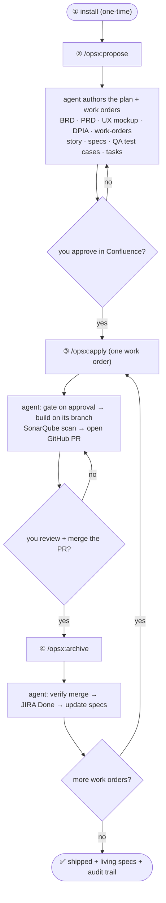

# End-to-End Tutorial — idea to shipped, governed feature

One running example: a self-service **"Data Export"** feature (users download their personal
data — a UU PDP / GDPR data-portability right). It touches personal data (so compliance lights
up) and has a UI (so the design-system flow lights up).

**You only ever use four commands:**

1. **install** — once per project
2. **`/opsx:propose`** — plan the feature until it's approved
3. **`/opsx:apply`** — build one work order
4. **`/opsx:archive`** — finalize it after merge

The agent runs every integration (Confluence, JIRA, GitHub, SonarQube) for you under the hood —
you never type those. Your only manual touchpoints are **approving pages in Confluence** and
**reviewing + merging PRs in GitHub**.



---

## ① Install (one-time)

Install the base CLI and initialize OpenSpec:

```bash
npm install -g @fission-ai/openspec        # base CLI
cd my-app && openspec init                  # pick "Claude Code"
```

Add the Forge kit — **bash / zsh:**

```bash
curl -fsSL https://raw.githubusercontent.com/c0d3beat/openspec-forge/main/install.sh | bash
```

**PowerShell:**

```powershell
irm https://raw.githubusercontent.com/c0d3beat/openspec-forge/main/install.ps1 | iex
```

Then set your hosts and tokens: edit `openspec/forge/connections.yaml` (JIRA/Confluence/GitHub/SonarQube
hosts), then copy `openspec/forge/.env.example` to `.env` and fill in the tokens.

The installer wires the kit in, adds a gate pre-commit hook, and runs a readiness check. Done.

---

## ② `/opsx:propose` — plan the feature until it's approved

```
/opsx:propose data-export
```

The agent turns your idea into an approved, tracked plan. It authors the epic's planning
artifacts in order, then the story-level artifacts for each work order:

```
data-export/  (the epic)          each work order/
├── brd.md                        ├── story.md       persona + acceptance criteria
├── prd.md                        ├── specs/**       requirements + scenarios (+ controls)
├── ux-design.md  (+ UI mockup)   ├── test-cases.md  QA / UAT cases from the scenarios
├── capabilities.md               └── tasks.md
├── compliance.md (DPIA)
└── work-orders.md
```

Along the way it **asks you to confirm the tech stack** (frontend / backend / database) if it isn't already
clear, and in the UX step **presents design-system options with a recommendation and asks you to choose**. It
renders the one-page UI mockup in your pick, publishes every document to Confluence (one page each, mockup
embedded), and creates the JIRA Epic + Stories.

**Your job:** review the pages in Confluence and add the `approved` label — the PM signs off the
PRD, the **DPO signs off the DPIA**, **QA signs off the test cases**, UX signs off the mockup. If
you leave comments, the agent folds them in and re-publishes (which clears approval, forcing fresh
sign-off). Propose isn't finished until the plan is approved — and the build won't start without it.

---

## ③ `/opsx:apply` — build one work order (repeat per work order)

```
/opsx:apply wo-export-request
```

The agent:

- **refuses to build unless the plan is approved** in Confluence (story **and** QA test cases),
- moves the JIRA story to **In Progress**,
- syncs the branch from the **latest remote** (the remote is the source of truth) so it never builds on stale code,
- implements **only this work order**, runs the **SonarQube** scan, and opens a **GitHub PR** (Sonar summary in the body) — moving the story to **In Review**.

**Your job:** review the PR and **merge** it on GitHub (on GitHub Free the merge is the human
decision; the gate + Sonar status inform it). QA then executes the approved test cases; any
failure becomes a JIRA defect the agent fixes on the same branch. Repeat for the next work order.

---

## ④ `/opsx:archive` — finalize after merge

```
/opsx:archive wo-export-request
```

The agent **verifies the PR is actually merged**, sets the JIRA story to **Done**, and folds the
work order's delta specs into `openspec/specs/` — so your living spec now describes the feature
as built.

---

## What you end up with

- **Shipped code** — one reviewed PR per work order.
- **Living specs** — `openspec/specs/` describes the feature as built.
- **Traceability (RTM)** — every requirement → work order → control → JIRA → approval → test cases → Sonar → branch. Hand it to an auditor.
- **Governance evidence** — DPIA approved by the DPO; UU PDP + ISO 27001 controls recorded; every build gated on approval, quality, and compliance.

From a fuzzy idea to enterprise-ready, auditable code — and OpenSpec's core was never modified.

---

## Notes

- **You never type integration commands.** The agent drives Confluence/JIRA/GitHub/SonarQube for you; the whole flow is the four commands above plus your Confluence approvals and GitHub merges.
- **JIRA status** tracks progress automatically: To Do → In Progress (apply) → In Review (PR opened) → Done (merge verified at archive).
- **Handoff.** Taking over someone's work on a fresh clone? Just tell the agent ("I'm taking over `<id>`") or run `/opsx:apply <id>` — it reconnects to Confluence/JIRA automatically (rebuilds the local `.forge/` cache, no duplicate pages) and continues; you don't run anything.
- **Enforcement (GitHub Free).** Governance is front-loaded (approve before build) and advisory at the merge button; a pre-commit hook also blocks commits until the gate passes. For a hard, server-side merge block, add GitHub Pro's required checks — no schema/script changes needed.
- **Deeper docs.** `openspec/forge/README.md` (command reference) and `openspec/forge/DESIGN.md` (design + lifecycle).
